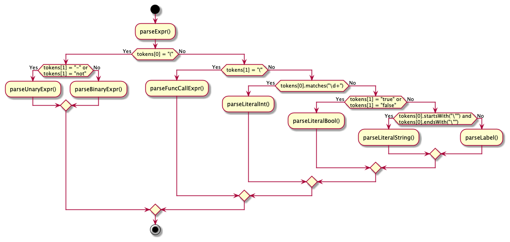

## homework-2

1. Flowchart of the `parseExpr()` method:



2. Four mutant codes for the `testTokenizeInvalidSymbol()` unit test we have written in our homework 1:

```java
private final Pattern[] patterns = {
    Pattern.compile("\\{"), // Mutant: Invalid token
    Pattern.compile("}"), // Mutant: Invalid token
    Pattern.compile("="), // Mutant: Invalid token
    Pattern.compile("!"), // Mutant: Invalid token
};
```

3. Table-based test scenario for the `parseStmt()` method:

| Test Case |       Source Code        |     Expected Output |
|:----------|:------------------------:|--------------------:|
| TC1       | while true do end while; |     WhileStmt.class |
| TC2       |   if true then end if;   |        IfStmt.class |
| TC3       |         print 1;         |     PrintStmt.class |
| TC4       |       print_line;        | PrintLineStmt.class |
| TC5       |       return true;       |    ReturnStmt.class |
| TC6       |      factorial(5);       |  FuncCallStmt.class |
| TC7       |         x := 1;          |    AssignStmt.class |

## homework-1

For this assignment we used JUnit5 and IntelliJ Idea.
Project: compiler for a simple programming language called Splat.


### Lexer

Lexical analysis converts splat source code into the list of tokens


### Parser

Parser converts the list of tokens into the abstract syntax tree


UML class diagrams


### Expressions


### Statements

