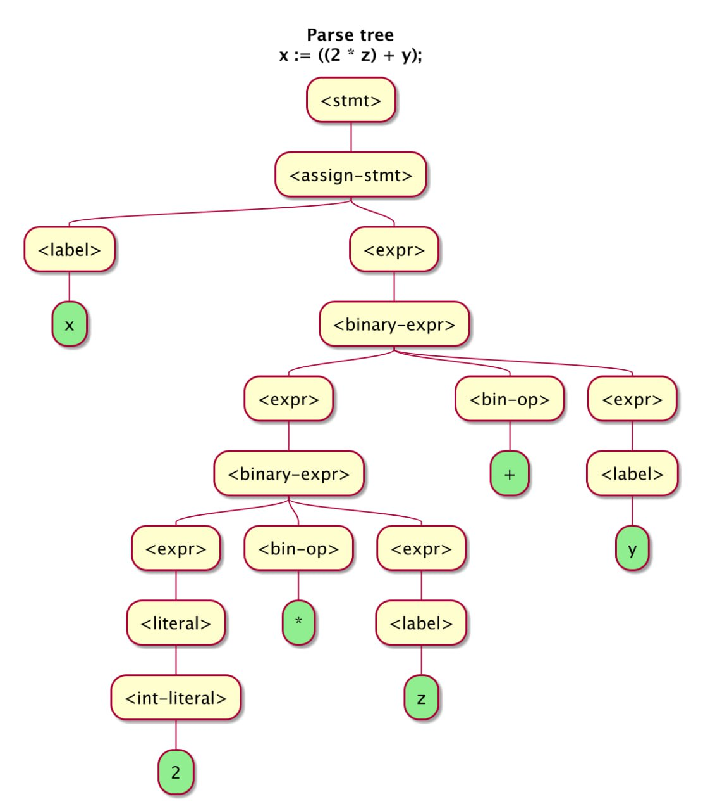

# homework-1

For this assignment we used JUnit5 and IntelliJ Idea.
Project: compiler for a simple programming language called Splat.

## Lexer

Lexical analysis converts splat source code into the list of tokens

## Parser

Parser converts the list of tokens into the abstract syntax tree

UML class diagrams

## Expressions

## Statements

