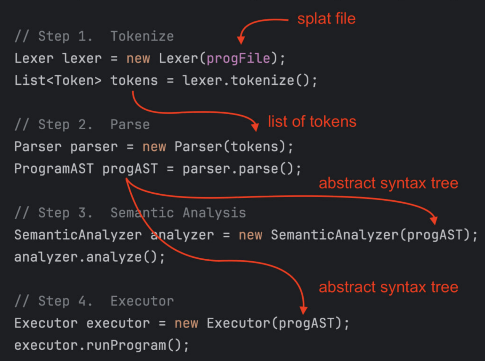
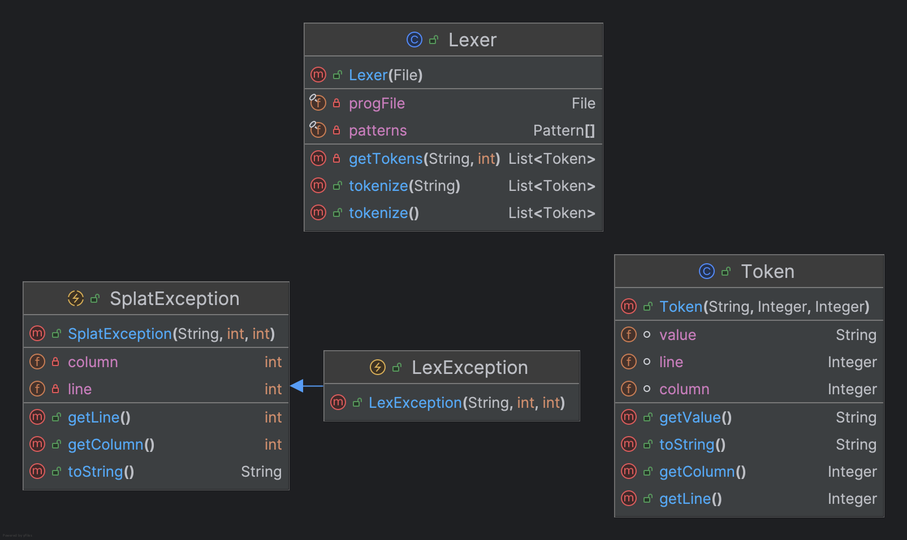
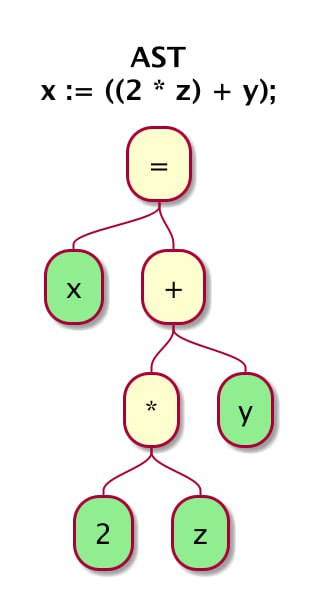
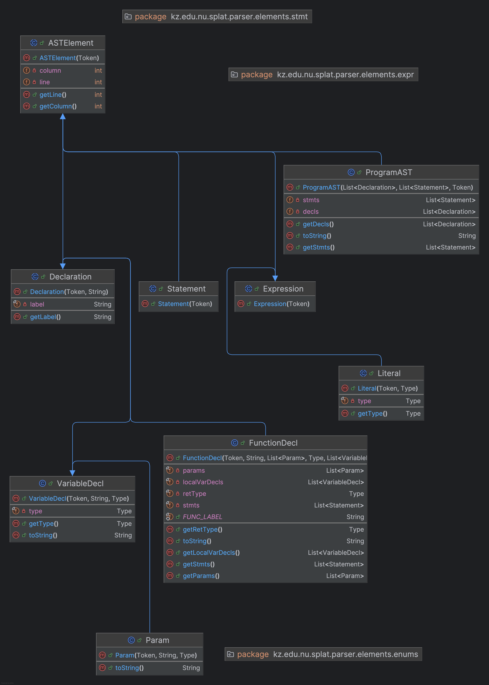
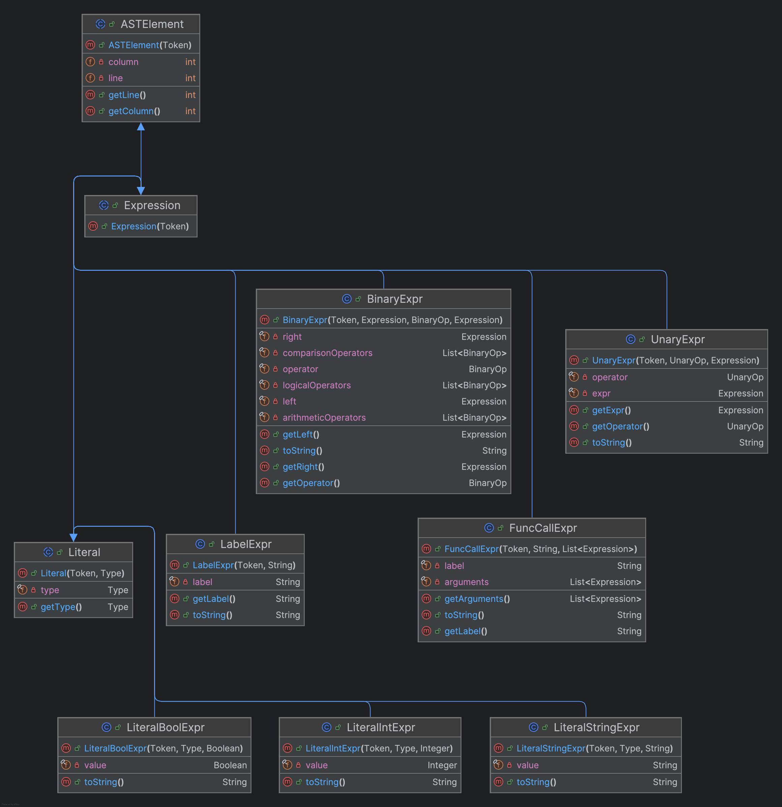
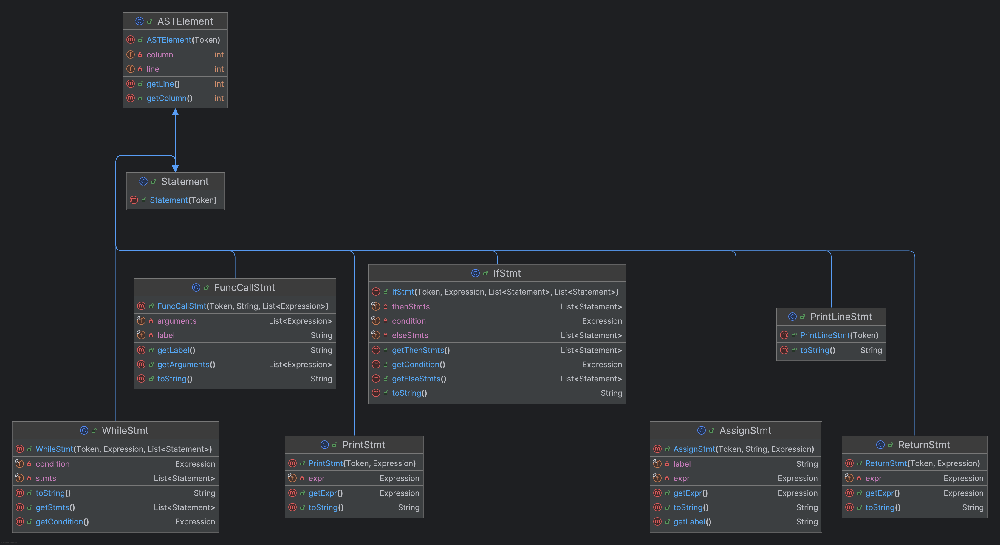

# homework-1

For this assignment we used JUnit5 and IntelliJ Idea.
Project: compiler for a simple programming language called Splat.

## Lexer

Lexical analysis of splat source code

## Parser

Lexical analysis of splat source code

UML class diagrams

## Expressions

## Statements

